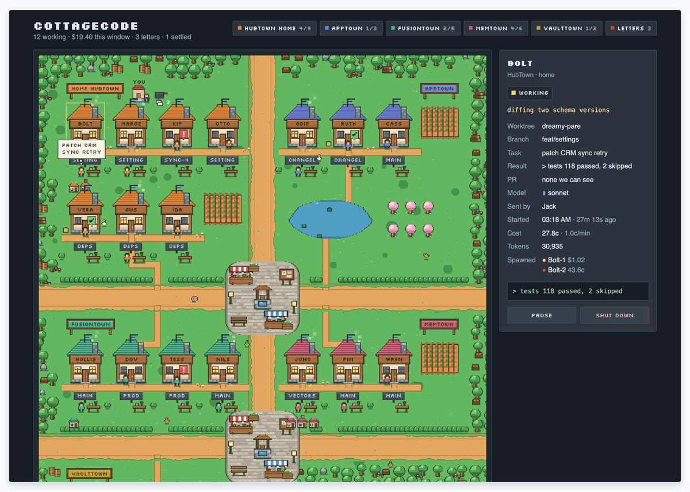
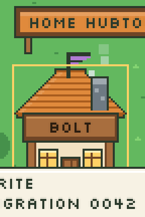
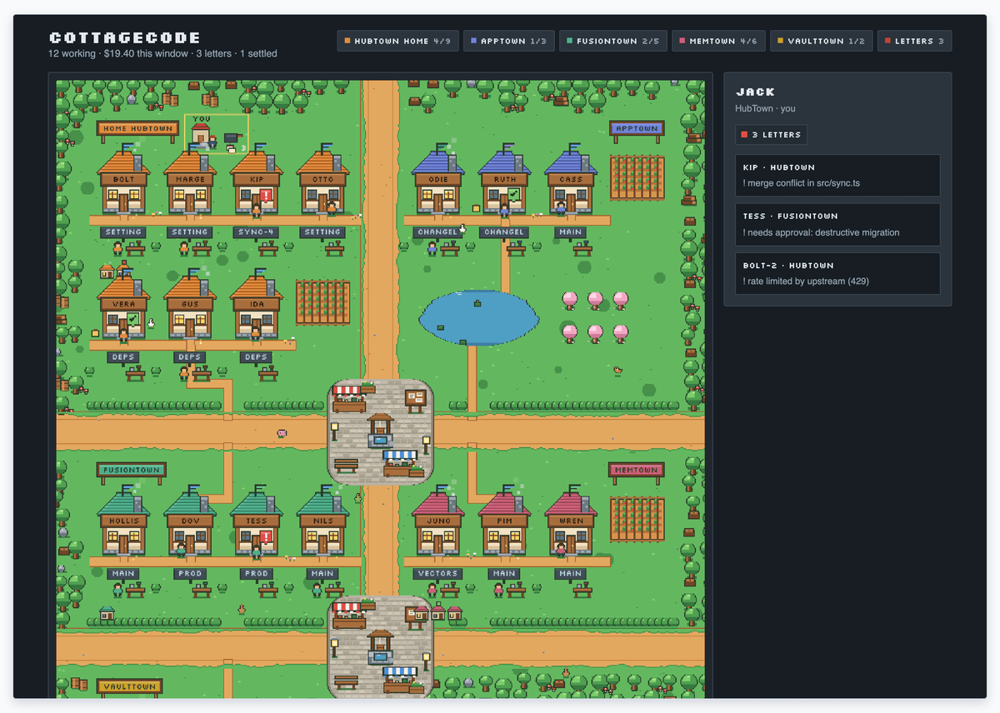

# 🏘️ CottageCode · v0.1.0

> **A pixel town for your agents.** Each cottage is one agent. Chimney smoke means it's working. Sheds are the ones it spawned.



CottageCode is a local townmap for agent fleets. Point it at any URL that returns cottages as JSON. The page ships with a demo town so you can poke around before you wire a real feed.

Townmap is the atlas view, not a second logo. Projects land as towns (`HubTown`, `MemTown`, or `{Stem}Town` from a folder name). We do not hash strangers into four fake role lanes.

Zero npm dependencies. Pixel canvas stays. No React rewrite on day one.

<p align="center">
  
</p>

## 🏃 Quick start

Node 22.13+.

```bash
git clone https://github.com/verygoodplugins/cottagecode.git
cd cottagecode
npm start
```

Open [http://localhost:8787](http://localhost:8787). For the built-in demo town only: [http://localhost:8787/?demo=1](http://localhost:8787/?demo=1).

That's it.

## 🔌 Cottage feed

`npm start` serves the townmap and `GET /agents`. The connect box defaults to that URL. Drop in any other endpoint that speaks the [cottage feed](docs/COTTAGE_FEED.md) shape.

Minimum cottage:

```json
{
  "id": "bolt-1",
  "name": "Bolt",
  "town": "HubTown",
  "status": "working",
  "task": "bump deps + run suite"
}
```

Statuses the map understands: `working` · `idle` · `blocked` · `done` · `offline`.

| Status | On the map |
|---|---|
| working | chimney smoke |
| idle | quiet house |
| blocked | red `!` (and a letter for you) |
| done | green check, then ages out |
| offline | grey / settled |

Roof flags: opus · sonnet · haiku · gpt · local · mlx.

Optional fields cover worktrees, branches, PRs, cost, tokens, spawned sheds, and Jack's letter pile. Full schema: [`docs/COTTAGE_FEED.md`](docs/COTTAGE_FEED.md).



Pause, wake, and shut down are **simulator-only**. They do not touch a live feed.

## 🧰 Bundled adapters

The local process can also populate `/agents` without you writing a server:

1. Readonly sqlite at `AGENT_DB_PATH` (an `agent_runs` table), if set
2. Claude Code session jsonl under `~/.claude/projects` (or `CLAUDE_PROJECTS_DIR`)
3. Demo town when both are empty, or when you open `/?demo=1`

Those are convenience adapters. The contract is the JSON feed.

```bash
# bind / port / snapshot
node src/feed.mjs --host 0.0.0.0 --port 8787
node src/feed.mjs --once > snapshot.json
```

## 🗺️ Legend

| Pixel | Meaning |
|---|---|
| smoke | working |
| `!` | blocked, needs you |
| shed | spawned child agent |
| yellow parcel | open PR |
| green parcel | merged PR |
| mail | letters waiting on Jack's stoop |

Settled cottages (old offline / finished ghosts) stay hidden until you flip **settled (N)**.

## License

MIT. Jack Arturo / [Very Good Plugins](https://github.com/verygoodplugins).

See also [Contributing](CONTRIBUTING.md) and [Security](.github/SECURITY.md).
